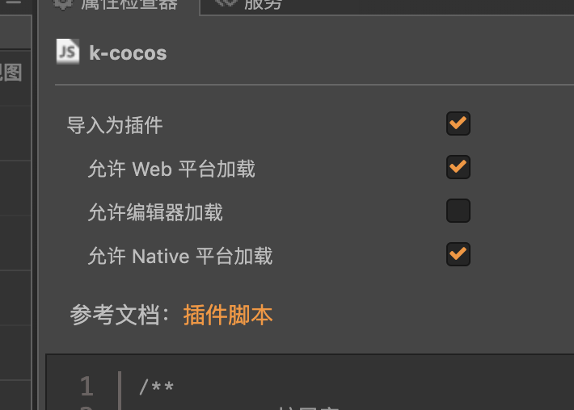

# KCocos扩展库

## 仓库地址
[https://github.com/KuoKuo666/k-cocos](https://github.com/KuoKuo666/k-cocos)

## 扩展功能
- 游戏速率控制
- 全局触点数量控制
- 节点属性方法扩展
- 扩展简易移动组件
- 常用工具函数
- 开发中...

## 如何使用
将 `k-cocos.js` 导入为插件即可。

详细的使用方法可以通过左侧目录来查看 API。

## 智能提示
为了 TypeScript 使用者也能够使用，在对应的 `kcocos.d.ts` 中补充了声明。
