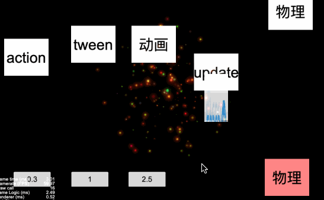

# 游戏速率控制

## 使用方法
通过该方法可以改变游戏运行速率，原理是通过改变脚本生命周期 `update` 中的 `dt`，可以影响到动作系统、动画系统、粒子系统等。
```javascript
// 正常速度
cc.kSpeed(1);
// 慢动作
cc.kSpeed(0.1);
```

若也想影响到物理系统需要开启同步刷新：
```javascript
cc.director.getPhysicsManager().enabled = true;
cc.director.getPhysicsManager().enabledAccumulator = true;
```

## 效果演示

